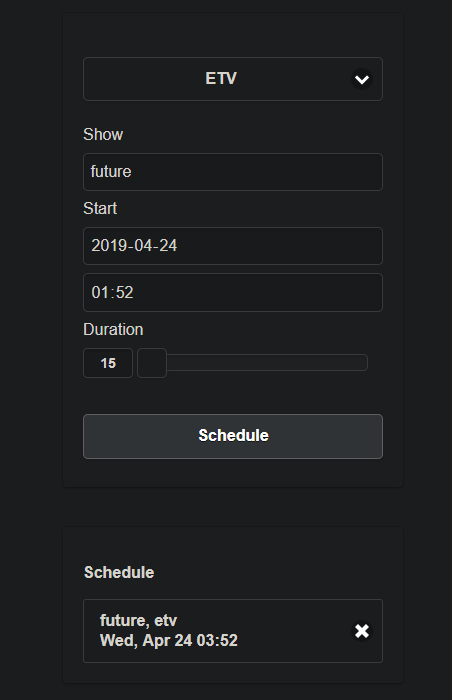

# recApi

A node.js REST API to schedule jobs in agenda to spawn ffmpeg to record stuff using URIs or predefined channels.

This is a learning project, expect everything to break.

It requires ffmpeg and mongodb available. Node dependencies are listed in the package.json file.

## Screenshot of UI (dark reader)




## Installation

```
git clone https://github.com/odtgit/recApi
cd recApi
npm install
```

## Configuration

Copy the config.yml.example file to config.yml and make your changes there. The docker-compose file has examples of bind mounds for external config and storage.


## Start

```
npm start
```

## Docker build and start

```
docker-compose up -d
```

## Usage

Browse to http://localhost:23030/
